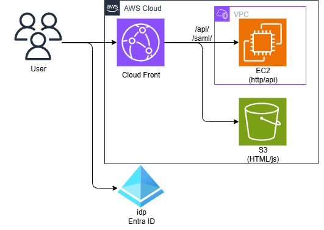
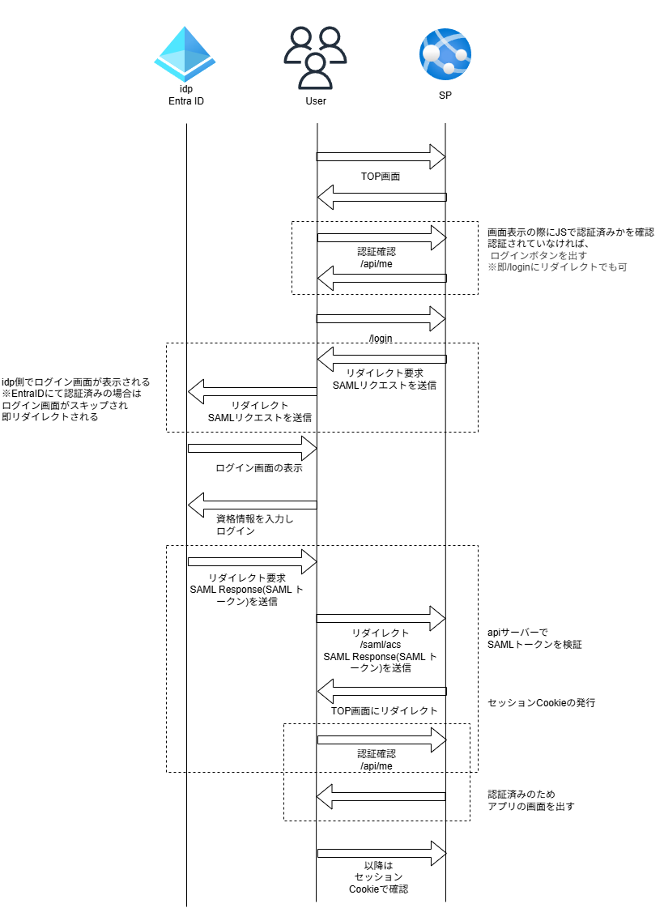

# SAML認証について

シンプルな構成でローカル環境のみでSAML認証について検証する

## 構成
今回は、reactなどでよくある構成を想定

ここでは、EntraID、CloudFront、S3はダミーを作成し
/apiサーバーの動きを確認



| 機能 | ソース |
|----- | ------ |
| CloudFront | fake-front.py |
| S3 | fake-front.py ※ここに含む |
| EntraID | fake-idp.py |
| EC2(api) | api-server.py |

※証明書はfake-idp.pyが作成し自動的にsetting.jsonへと書き込んでいるが、実際には、EntraIDからコピーしてくる必要があるので注意

## SAMLの認証フロー




# 確認の仕方

## 構築
``` bash
uv sync
```

## 確認
### 起動
 1. fake idpの起動
    ``` bash
    .venv\Scripts\activate
    uvicorn fake-idp:app --port 9000 --reload
    ```

 2. api serverの起動
    ``` bash
    .venv\Scripts\activate
    uvicorn api-server:app --port 8001 --reload
    ```

 3. fake frontの起動
    ``` bash
    .venv\Scripts\activate
    uvicorn fake-front:app --port 8080 --reload
    ```

### ログイン
http://localhost:8080/

### API
http://localhost:8080/api/me